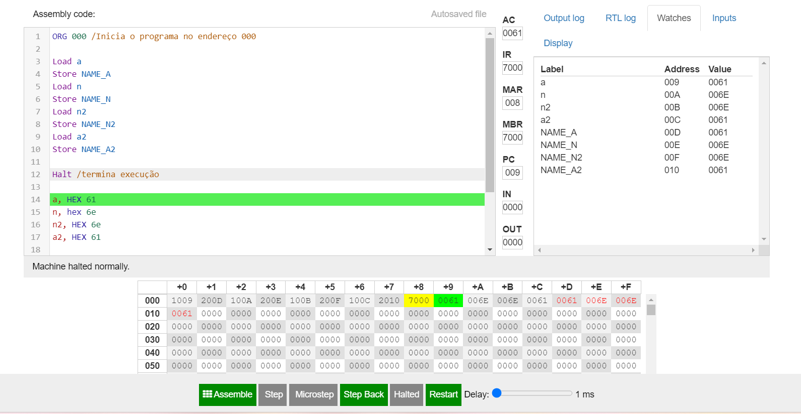
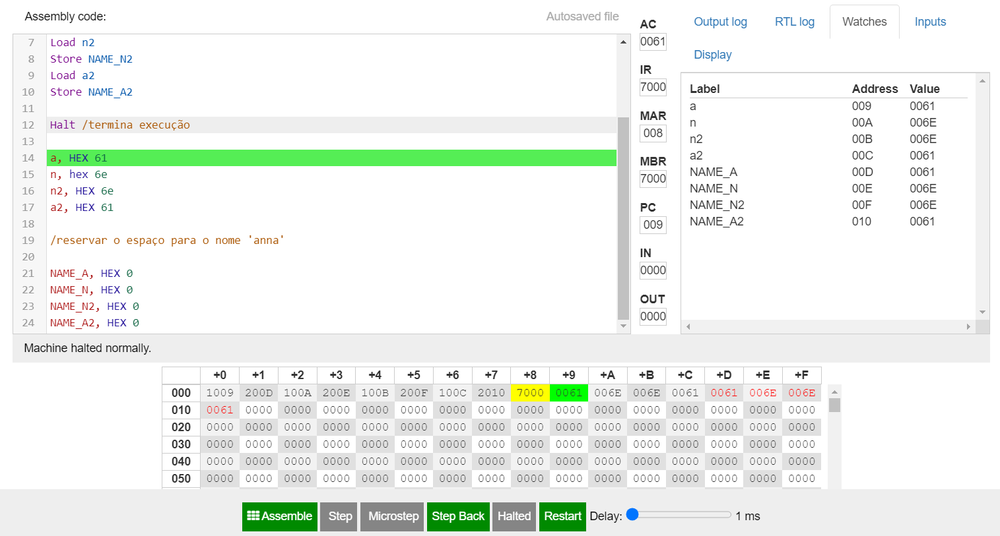
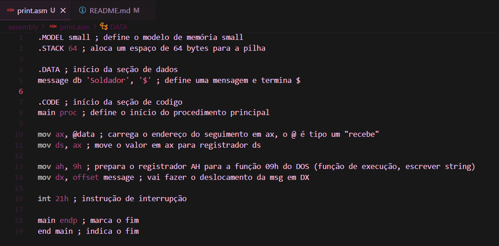
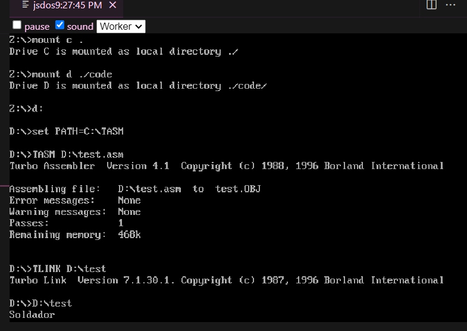

# assembly

# primeira atividade:

# Explicação:
 > a alocação de memória dinâmica em que armazena o meu nome se parte quando clicado em "watches", ele mostra em que cada coisa está, como por exemplo a = 0061; n = 006e; além disso, na tabela abaixo os números que estão em vermelho são onde estão alocados na memória, já que meu nome possui quatro letras, são quatro espaços.

# segunda atividade:

## DOS em assembly; subir o código; explicar o funcionamento dos registradores.

# Explicação:
 > 1. foi instalado uma expanção chamada MASM/TASM que utiliza DOS, este ".asm" no fim da palavra print, é o que liga a ele. eles ajudam a traduzir o código em assembly para código em máquina executável. os códigos descritos acima são em assembly para DOS.

 > 2. o código comentado está no print acima, assim como será deixado por escrito:

 > .MODEL small ; define o modelo de memória small
.STACK 64 ; aloca um espaço de 64 bytes para a pilha
.DATA ; início da seção de dados
message db 'Soldador', '$' ; define uma mensagem e termina $
.CODE ; início da seção de codigo
main proc ; define o início do procedimento principal
mov ax, @data ; carrega o endereço do seguimento em ax, o @ é tipo um "recebe"
mov ds, ax ; move o valor em ax para registrador ds
mov ah, 9h ; prepara o registrador AH para a função 09h do DOS (função de execução, escrever string)
mov dx, offset message ; vai fazer o deslocamento da msg em DX
int 21h ; instrução de interrupção
main endp ; marca o fim
end main ; indica o fim

 > 3.  os registradores utilizados foram: AX, AH, DS, DX. registradores são componentes fundamentais em arquiteturas de processadores e desempenham papéis vitais no funcionamento do processador e na execução de instruções.

 

 # explicação:

 > ele rodou o código e as coisas que estavam descritas nele, por conta dos registgradores, como por exemplo: os deslocamentos de mensagem, preparar o registrador AH. no fim de tudo, ele printou a palavra "Soldador", como havia sido colocado no início do código com "message db". 
